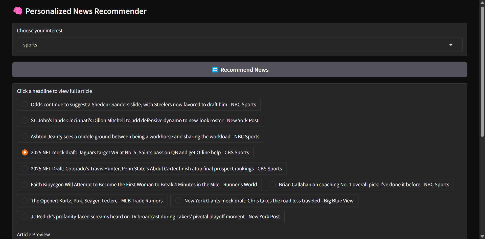
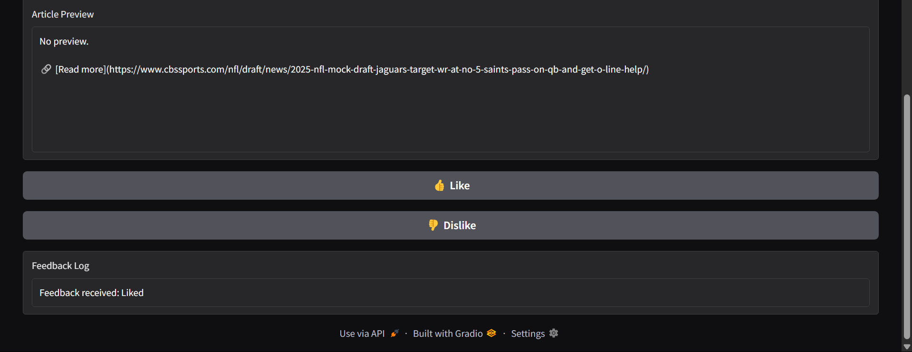

# Personalized News Recommendation System

This project implements a **Personalized News Recommendation System** using Deep Q Networks (DQN), **News API**, and **Gradio**. The system recommends articles based on user interests and adapts to user feedback. The recommendation model is trained to dynamically update based on the categories users choose, such as Technology, Science, Health, etc.

## Demo Screenshot



## Features
- **Personalized Recommendations**: Choose from multiple categories (e.g., Technology, Sports, Health).
- **User Feedback**: Like or Dislike news articles to refine future recommendations.
- **DQN Agent**: Trains using user interactions (clicking on headlines) to recommend the most relevant articles.
- **Real-Time Updates**: News headlines are updated automatically based on the chosen category.

## Demo
[Demo APP](https://huggingface.co/spaces/Ankitsm04/News_Recommendation_System)

## Tech Stack
- **Python**: The core programming language for this project.
- **Gradio**: For creating an interactive UI.
- **TensorFlow**: For implementing the DQN (Deep Q Network) algorithm.
- **News API**: To fetch real-time news articles.
- **Numpy**: For efficient numerical operations.

## Installation

### Prerequisites

Ensure you have Python 3.6 or higher installed. You can check your Python version by running:

```bash
python --version
